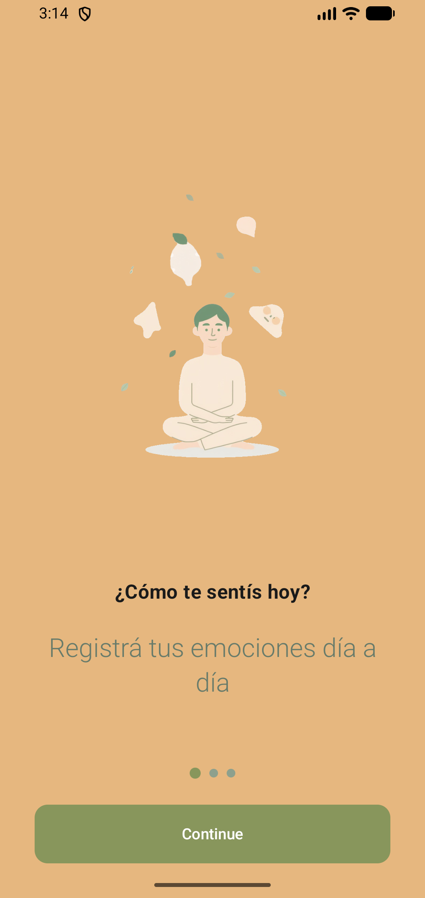
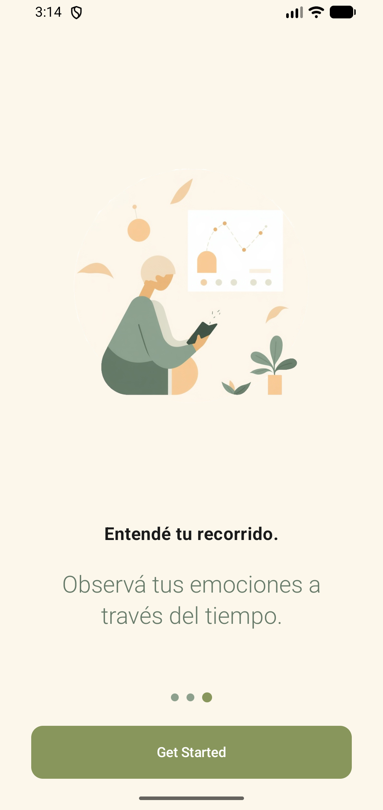
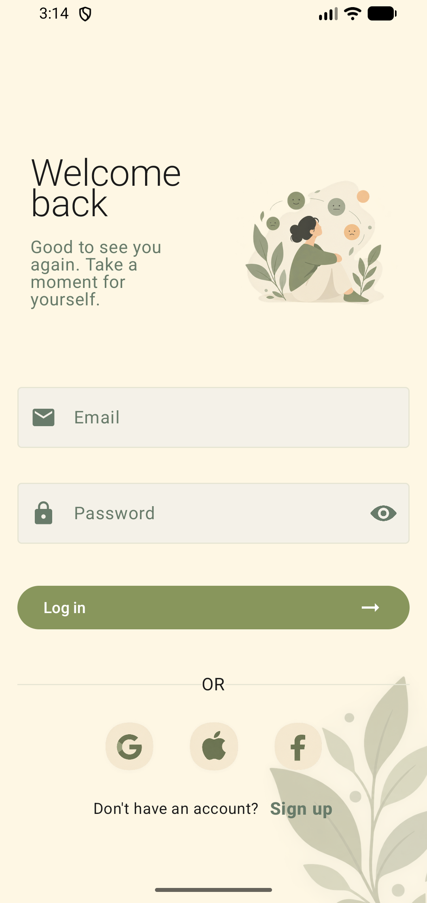
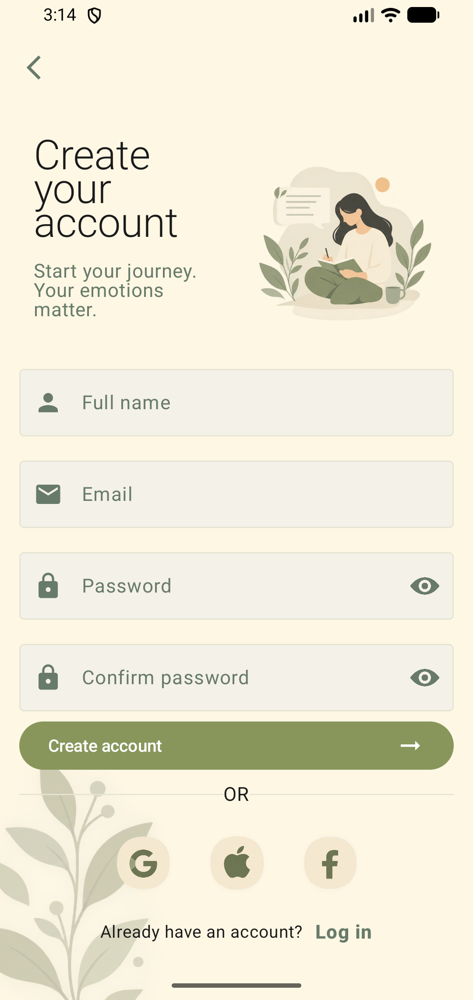
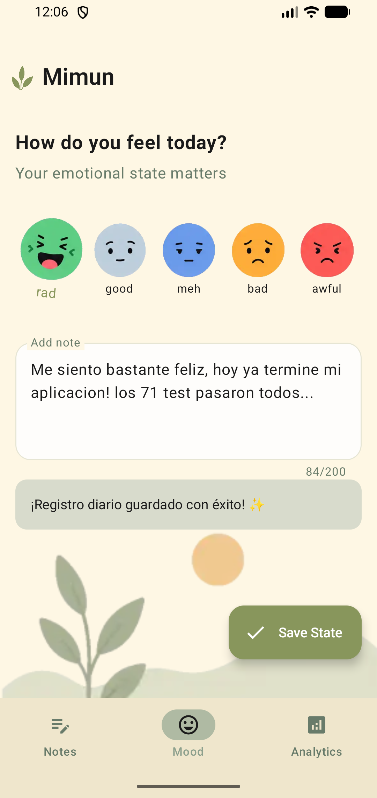
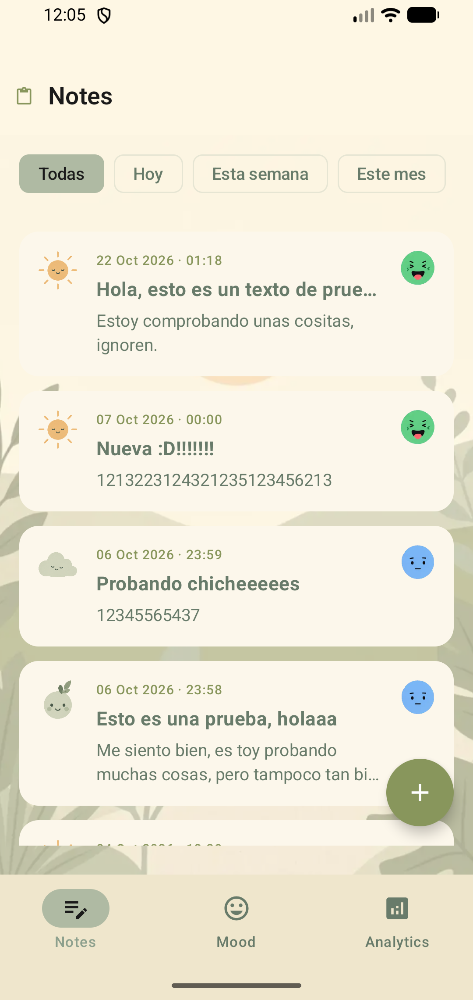
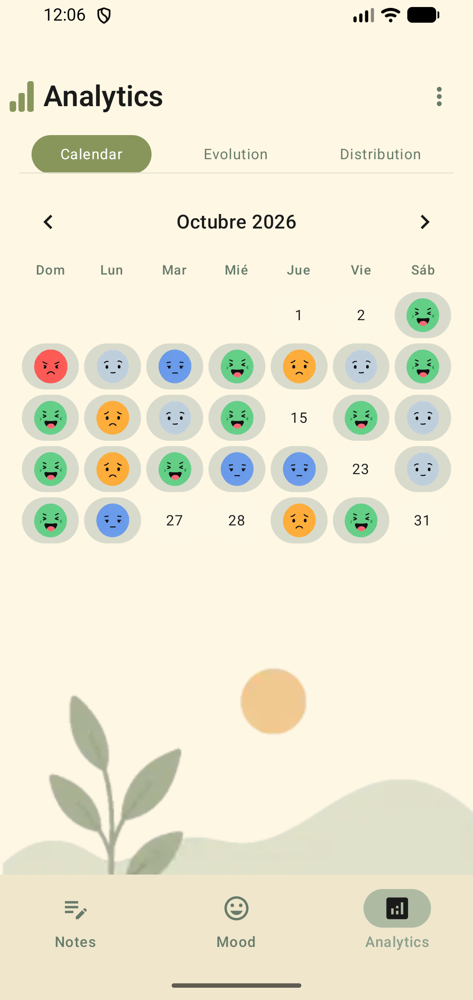
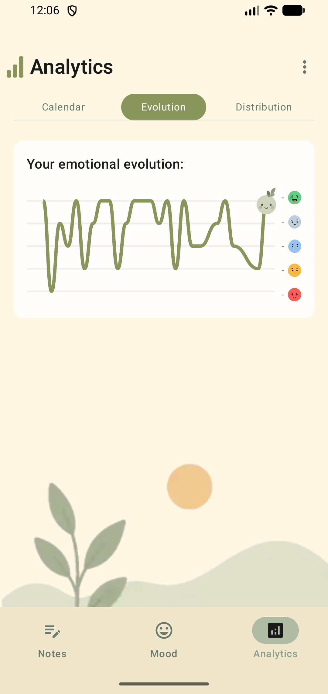
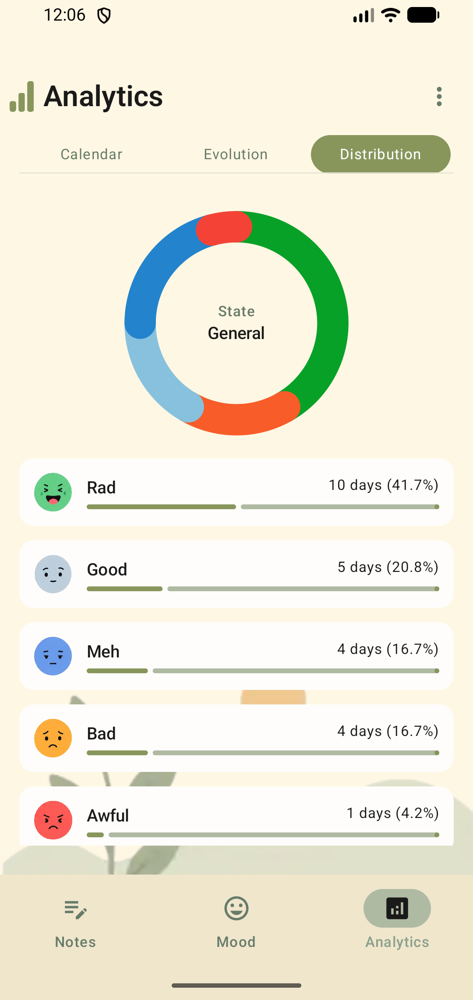

# 🫧 Mimun — Tu diario emocional

<p align="center">
  <b>Una aplicación móvil minimalista y elegante para el bienestar emocional, construida en Android nativo con Kotlin y Jetpack Compose.</b>
</p>

<p align="center">
  
  
  
  
</p>

---

## 📱 Recorrido Visual de la Aplicación (*User Flow*)

### 1. Flujo de Onboarding
Bienvenida inmersiva que introduce al usuario en la filosofía de calma y reflexión de Mimun.

<p align="center">
   &nbsp;&nbsp;
   &nbsp;&nbsp;
  
</p>

---

### 2. Autenticación (Login & Registro)
Sistema seguro de acceso con JWT, validación de formularios y manejo de sesiones.

<p align="center">
   &nbsp;&nbsp;&nbsp;&nbsp;
  
</p>

---

### 3. Pantalla Principal: Registro Emocional (*Mood / Inicio v1.1.0*)
Selección de estados de ánimo (`RAD`, `GOOD`, `MEH`, `BAD`, `AWFUL`) con personajes animados por fotogramas (*frame-by-frame*), campo de nota rápida y diseño orgánico.

<p align="center">
  
</p>

---

### 4. Diario de Reflexiones (*Notes v1.1.0*)
Gestión completa de notas con iconos aleatorios automáticos (`apple`, `sun`, `sky`, `great_v2`), filtrado avanzado por fechas (*Todas*, *Hoy*, *Esta semana*, *Este mes*) y visualización detallada en pantalla completa.

<p align="center">
  
</p>

---

### 5. Estadísticas e Historial (*Analytics v1.1.0*)
Visualización en tres pestañas (*Calendar*, *Evolution*, *Distribution*): calendario mensual con emojis, curva de evolución emocional con personaje dinámico en la punta y gráfico circular de distribución (*Donut Chart*).

<p align="center">
   &nbsp;&nbsp;
   &nbsp;&nbsp;
  
</p>

---

## 📍 Estado actual del Proyecto

| Módulo | Estado | Detalle |
|---|---|---|
| 📱 [Frontend](./Frontend/README.md) | 🟢 Completado (v1.1.0) | Interfaz nativa, Room, Sincronización offline-first, Animaciones y Gráficos avanzados. |
| 🖥️ [Backend](./Backend/README.md) | 🟢 Completado (v1.1.0) | API REST en FastAPI, PostgreSQL, Alembic, Autenticación JWT y tests en verde. |
| 📚 [Docs](./Docs/) | ✅ Hecho | Contrato de la API, esquema de base de datos y registro de decisiones. |

---

## 🗂️ Estructura del Repositorio

```
Mimun --- Tu diario Emocional/
├── README.md          ← este documento (presentación oficial)
├── ROADMAP.md         ← plan general de desarrollo
├── Media/             ← capturas de pantalla organizadas por flujos (*screenshots*)
├── Frontend/          ← app Android (Kotlin + Jetpack Compose)
├── Backend/           ← API REST (Python + FastAPI + PostgreSQL)
└── Docs/
    ├── api/           ← contrato de la API (fuente de verdad)
    ├── database/      ← esquema de base de datos
    └── decisions/     ← registro de decisiones arquitectónicas
```

---

## 😊 Estados Emocionales

Los valores son **exactamente** estos, en mayúsculas y en inglés, idénticos en Android, API, base de datos y tests:

`RAD`, `GOOD`, `MEH`, `BAD`, `AWFUL`

| Valor | Significado |
|---|---|
| `RAD` | La está pasando genial |
| `GOOD` | Se siente bien |
| `MEH` | Indiferente / sin demasiadas emociones |
| `BAD` | Not se encuentra bien |
| `AWFUL` | Estado emocional muy negativo |

Escala de mejor a peor: `RAD → GOOD → MEH → BAD → AWFUL`.

- `NORMAL` **no existe**: fue eliminado por decisión del autor ([decisión 0002](./Docs/decisions/README.md)).
- Los textos que ver el usuario son responsabilidad del Frontend, no del enum.

---

## 🧱 Arquitectura y Clean Architecture

Ambos lados (Frontend y Backend) siguen estrictamente **Clean Architecture**: las dependencias apuntan siempre hacia el dominio, manteniéndolo libre de frameworks, bases de datos o UI.

```
📱 Android  ──HTTP/JSON──▶  🖥️ API REST (/api/v1)  ──▶  🗄️ PostgreSQL
```

- **IDs Universales:** UUIDs generados en el cliente para permitir creación y lectura offline con sincronización posterior.
- **Privacidad:** Datos personales protegidos, contraseñas hasheadas y almacenamiento local cifrado (`EncryptedSharedPreferences`).

---

## 🧰 Stack Tecnológico

| Módulo | Tecnología |
|---|---|
| **Frontend** | Kotlin, Jetpack Compose, Material 3, Room, Retrofit, kotlinx.serialization |
| **Backend** | Python 3.12+, FastAPI, SQLAlchemy 2.x, Alembic, PostgreSQL |
| **Infraestructura** | Docker & Docker Compose |
